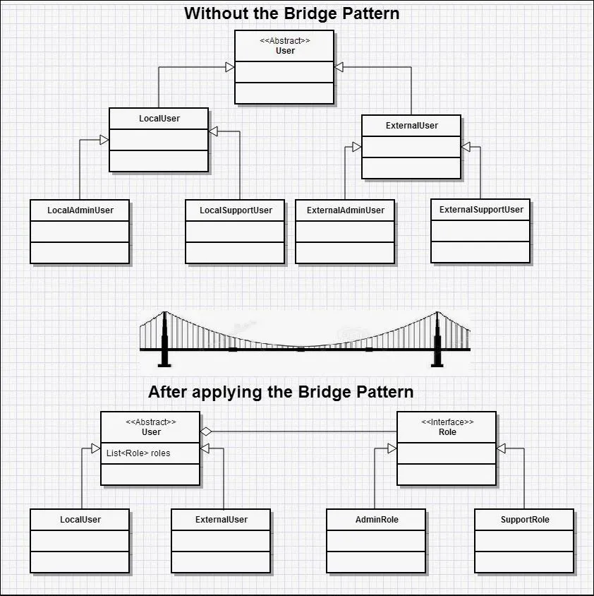

# Bridge
The Bridge pattern helps untangle unnecessary complicated class hierarchy, especially when 
implementation-specific classes are mixed together with implementation-independent classes.

For example, if you have two implementations of doing the same thing (they might call two different APIs) then 
you could have a generic implementation-independent class, which defines the common methods/properties, 
and give it with one of the implementation-specific classes to use in the back-end.

So here, you would instantiate a LocalUser, and give it an instance of an interface that is
the implementation for performing actions. This allows the User to scale - you could add a SuperUser and 
give it either the Admin or Support role, rather than having to write additional classes to cover each new variant.

source: https://www.java-success.com/wp-content/uploads/2014/12/design-pattern-4-bridge.jpg

## Problem
There are two unrelated, parallel, or orthogonal abstractions
- first is implementation specific
- second is implementation-independent

## Scenario
Implementation-independent circle abstraction - how to define properties of a circle and scale it
Implementation-dependent circle abstraction - how to draw a circle

## Solution
Separate the abstractions into two different class hierarchies.

## Related patterns
Abstract Factory
Adapter
